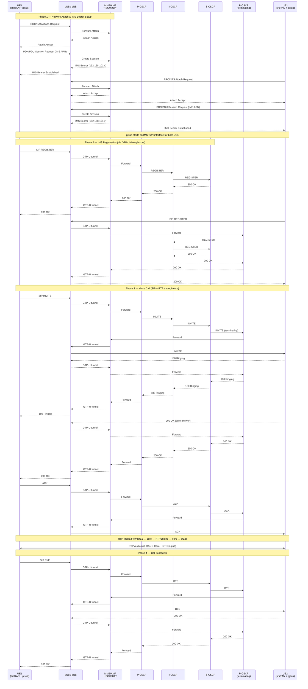

# End-to-End VoLTE/VoNR Test Strategy

## Goal

Exercise the full end-to-end call path for VoLTE (4G) and VoNR (5G) without requiring SDR hardware or real phones. Prove that the **entire stack** works — RAN, core network (EPC/5GC), and IMS — including UE attachment, PDN/PDU session establishment, IMS APN bearer setup, SIP registration, call routing, and RTP media flow.

---

## Approach

Use **srsRAN UE** (ZMQ simulation, no SDR needed) for the radio and core network layers, with **pjsua** running on top of the UE's IMS APN TUN interface for SIP/voice. Kamailio's authentication is relaxed from IMS-AKA to standard SIP Digest auth.

The critical insight is that pjsua must **not** connect directly to the P-CSCF on the Docker network. Instead, it runs inside the srsRAN UE container and sends SIP/RTP traffic through the UE's IMS bearer — so every packet traverses the full path:

```
pjsua → TUN interface (IMS APN) → eNB/gNB → MME/AMF → SGW/UPF → P-CSCF → IMS
```

This exercises the core network data plane (GTP-U tunnels, PFCP sessions, bearer QoS) in addition to the IMS signaling and media layers.

### Why pjsua

- First-class CLI tool, no GUI dependencies — runs cleanly in containers
- Supports `--null-audio` for headless operation (no sound card needed) and `--play-file` for WAV playback
- Fully scriptable: auto-answer, auto-hangup, call duration control
- AMR codec support for realistic VoLTE media
- Industry standard for SIP testing in telecom labs
- Tiny footprint compared to Linphone or other softphone options

### What's Real vs. Simplified

| Layer | Real | Simplified |
|-------|------|------------|
| RAN (eNB/gNB + UE) | Yes — srsRAN with ZMQ | RF is simulated (no over-the-air) |
| Core network attach (NAS) | Yes — full EPC/5GC attach | — |
| PDN/PDU session (IMS APN) | Yes — UE gets IMS bearer IP | — |
| GTP-U / PFCP data plane | Yes — packets traverse SGW/UPF | — |
| SIP routing (P-CSCF → I-CSCF → S-CSCF) | Yes | — |
| Diameter lookups (S-CSCF → PyHSS via Cx) | Yes | — |
| RTP media through RTPEngine | Yes | — |
| Call setup/teardown (INVITE/BYE) | Yes | — |
| Codec negotiation (AMR-NB/PCMA) | Yes | — |
| DNS resolution (3GPP FQDNs) | Yes | — |
| IMS subscriber provisioning (PyHSS) | Yes | — |
| SIP authentication | Digest auth | IMS-AKA with Milenage is skipped |
| IPsec security associations | Skipped | Would require full IMS-AKA |

### Why Not IMS-AKA

IMS-AKA authentication requires Milenage (the same algorithm used in SIM cards) on the client side. No mainstream CLI SIP client supports it natively. Relaxing to Digest auth at the Kamailio layer lets us test the entire IMS call path without needing custom cryptographic glue code. This is a standard approach in telecom lab environments.

---

## Implementation Plan

### Step 1: Extend the srsRAN UE Container with pjsua

Instead of a separate container, install pjsua **inside** the existing srsRAN UE container (or create a derived image). This is critical — pjsua must bind to the UE's IMS APN TUN interface so that SIP/RTP traffic flows through the core network, not over the Docker bridge.

The extended image needs:
- pjsua compiled with OpenSSL and AMR codec support
- Null audio device support for headless operation
- A startup script that waits for the IMS APN bearer to come up (TUN interface with 192.168.101.x address), then launches pjsua bound to that interface

### Step 2: Configure srsRAN UE for Dual APN

The srsRAN UE must establish **two PDN connections**:
- **internet APN** — default data bearer (192.168.100.x)
- **ims APN** — dedicated bearer for voice (192.168.101.x)

pjsua binds to the IMS APN interface. The UE's USIM credentials must match what's provisioned in both Open5GS and PyHSS.

### Step 3: Adjust Kamailio Auth (P-CSCF / S-CSCF)

Modify the Kamailio P-CSCF and S-CSCF configurations to accept standard SIP Digest authentication instead of IMS-AKA:
- P-CSCF: bypass IPsec SA setup, accept digest REGISTER
- S-CSCF: use Digest auth challenge/response instead of AKAv1-MD5

These changes should be isolated (e.g., via an environment variable flag or a separate config overlay) so the existing IMS-AKA path is not broken for real phone testing.

### Step 4: Create Docker Compose Files

Two new compose files for the test UEs:

**For 4G VoLTE testing:**
- `srsue_volte_zmq.yaml` — srsRAN 4G UE with pjsua, connects to `srsenb_zmq`
- Requires the core stack from `4g-volte-deploy.yaml` to be running

**For 5G VoNR testing:**
- `srsue_vonr_zmq.yaml` — srsRAN 5G UE with pjsua, connects to `srsgnb_zmq`
- Requires the core stack from `sa-vonr-deploy.yaml` to be running

Each compose file deploys two UE instances (UE1 and UE2) with different IMSI/MSISDN credentials.

### Step 5: Add a Test Script

A script that automates the full flow:
1. Provision two subscribers in Open5GS (core network attach + IMS APN)
2. Provision two IMS subscribers in PyHSS (via REST API)
3. Deploy the RAN (eNB or gNB via ZMQ)
4. Deploy both UE containers
5. Wait for UEs to attach to the core and establish IMS bearers
6. Wait for pjsua to register with the P-CSCF (watch for 200 OK)
7. UE1 calls UE2 (SIP INVITE to UE2's MSISDN)
8. UE2 auto-answers
9. Hold the call for a configurable duration
10. Hang up (BYE)
11. Verify call completion in logs
12. Report pass/fail

---

## Expected Call Flow

This diagram assumes a **single-PLMN scenario**: both UEs are subscribers of the same operator, attaching to the same RAN, the same core network (EPC or 5GC), and the same IMS. There is no roaming, no inter-PLMN signaling, and no IBCF in the path. An inter-PLMN scenario (where UE1 and UE2 belong to different operators) would require the IBCF component and Diameter/SIP peering between two separate IMS domains — that is captured as a future enhancement.



> **Note:** All SIP and RTP traffic between UEs and the IMS traverses the full data plane: UE TUN interface → eNB/gNB → GTP-U → SGW-U/UPF → P-CSCF. Nothing bypasses the core.

---

## Components Exercised

This test validates the following components end-to-end:

### RAN Layer
- **srsRAN eNB/gNB** — radio simulation (ZMQ), RRC, scheduling
- **srsRAN UE** — NAS attach, authentication, bearer setup

### Core Network (EPC for 4G / 5GC for 5G)
- **MME / AMF** — UE attach, authentication, session management
- **HSS / AUSF+UDM+UDR** — subscriber authentication, credential lookup
- **SGW-C+SGW-U / SMF+UPF** — GTP-U tunnels, PFCP sessions, IMS APN bearer
- **PCRF / PCF** — QoS policy for voice bearer

### IMS Layer
- **P-CSCF** — SIP proxy, RTPEngine control, policy enforcement
- **I-CSCF** — HSS lookup, S-CSCF routing
- **S-CSCF** — Registration, call routing, iFC evaluation
- **PyHSS** — Diameter Cx (subscriber lookup, auth vectors)
- **RTPEngine** — RTP/RTCP media relay, codec negotiation
- **DNS** — 3GPP FQDN resolution, SRV/NAPTR records
- **MySQL** — IMS user location, dialog state

---

## Prerequisites

Before running the test:
1. The full core + IMS stack must be deployed and healthy (`4g-volte-deploy.yaml` or `sa-vonr-deploy.yaml`)
2. The RAN must be deployed (`srsenb_zmq.yaml` for 4G or `srsgnb_zmq.yaml` for 5G)
3. Two subscribers must be provisioned in **both** Open5GS (for core attach + IMS APN) and PyHSS (for IMS registration)
4. The DNS container must be resolving the IMS domain correctly
5. RTPEngine must be running and reachable through the core network data plane

---

## Future Enhancements

Once the basic end-to-end test works, these can be added incrementally:

- **Audio verification** — play a known WAV file on UE1 and capture/compare on UE2
- **Video call testing** — add VP8/H.264 codec support to pjsua
- **SMS testing** — send SIP MESSAGE through SMSC
- **Multi-call scenarios** — conference calls, call transfer, call hold
- **Failure injection** — kill individual IMS components mid-call and verify behavior
- **Restore IMS-AKA** — integrate libmilenage into a custom pjsua build for realistic auth
- **UERANSIM variant** — replicate the same approach using UERANSIM instead of srsRAN for 5G-only testing
